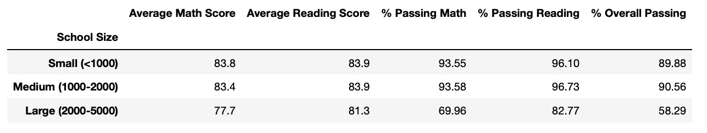

# School District Analysis

## Overview
The purpose of this analysis was to create a more thorough report that removes data that invovled academic dishonesty from the first school district analysis. This project was to clean up the bad data and create a new analysis with just the academically-honest data.

## Results
- How is the district summary affected?
The district summary now has a slightly changed analysis of data, it's corrected, but the change isn't huge.
This is the original non-adjusted data vs adjusted data:

- How is the school summary affected?
The school summary has a big difference in scores specifically for Thomas High School - from a very passing percentage, to a mediocre one. Here are the two school summaries compared:

- How does replacing the ninth graders’ math and reading scores affect Thomas High School’s performance relative to the other schools?
Thomas High School is clearly not one of the best performing schools in this set!
- How does replacing the ninth-grade scores affect the following:
  - Math and reading scores by grade

  - Scores by school spending

  - Scores by school size

  - Scores by school type

## Summary
